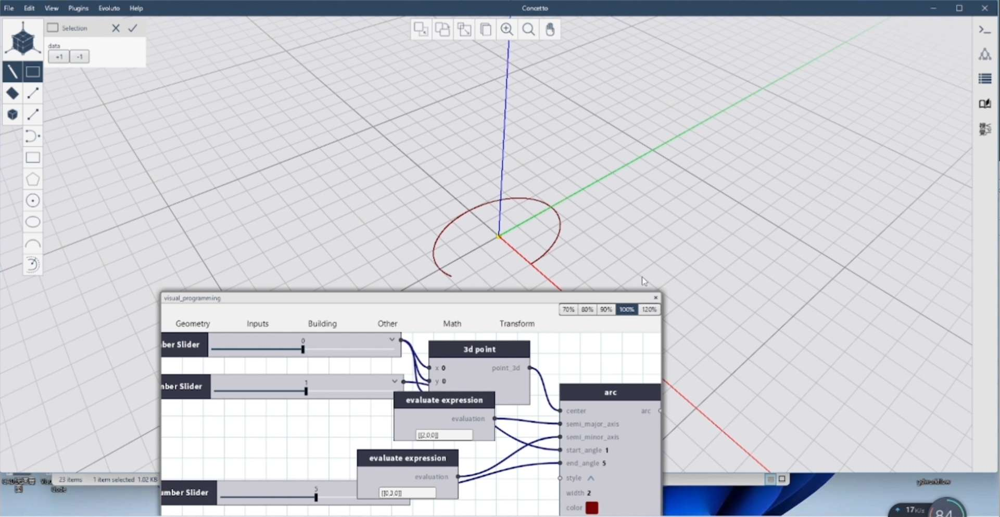
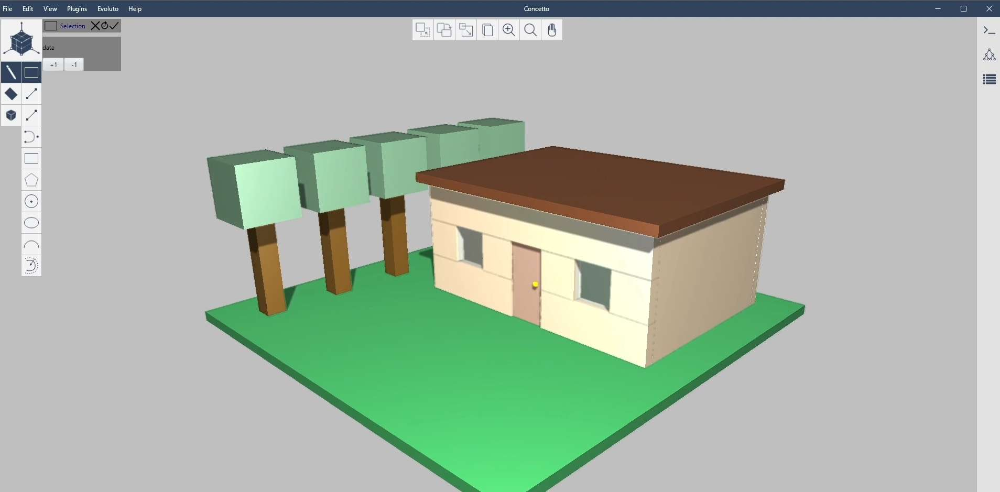

Glodon USA developed Concetto, a prototype generative and computational design environment with a visual scripting Python layer, 

and high-performance Vulkan graphics in portable React-like front end.

